# 本游戏使用unity引擎实现

将项目clone之后使用unity导入文件夹即可实现游戏的预览和使用。

# 当前项目已实现功能

- 游戏的基础玩法设计（无限地图生成、传送门、碰撞（血包、金币、障碍物））功能已实现
- 游戏的基础页面UI，包括前端登录页面、注册页面、教程页面、游戏结束页面、排行榜页面、游戏暂停页面等已经实现
- 游戏的基础动画设计及动画转换逻辑以实现并时装在游戏上
- 游戏已对接数据库、能及时上传游戏数据到数据库
- 游戏的后台管理系统（玩家信息管理、排行榜记录管理及分析）已实现
- 对游戏主体玩法已进行单元测试及分析

- 救人系统已经相应的buff已经颇具雏形

# 项目页面截图及功能介绍

β版本项目已部署于：》》》》》[双人合作划船游戏](http://43.143.185.60/)《《《《《《《

### 游戏登录界面

​	进入项目可以看到游戏登录界面，在主登录框可以输入用户的账号密码进入游戏，如果没有账号密码可以点击“注册”按钮进行注册，登录和注册的时候会进行基础的账号密码检查和提示。右上角三个按钮的功能分别为开关背景音乐，查看排行榜以及设置界面：

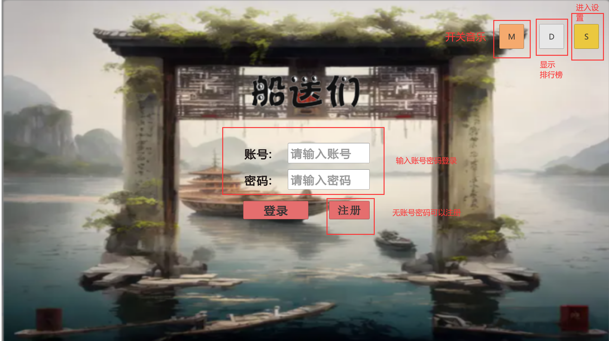

​	在设置界面我们可以调节游戏的音乐大小，并查看游戏的操作说明：

​	本游戏为双人合作划船游戏，玩家1使用键盘A/D控制划船方向，Q/E控制发射传送门的箭头方向，W发射传送门；玩家2使用键盘←/→控制划船方向，鼠标控制传送门发射位置（玩家2可以往任意位置发送传送门），鼠标左键发射传送门。

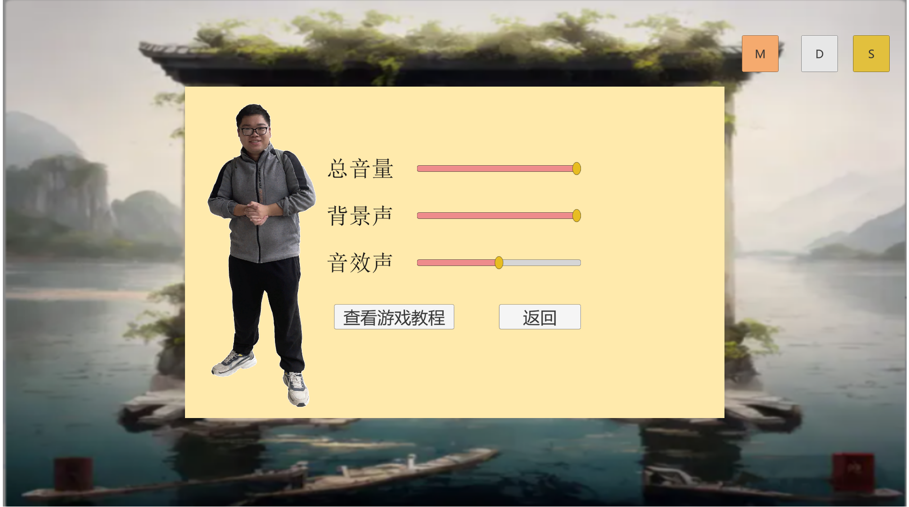

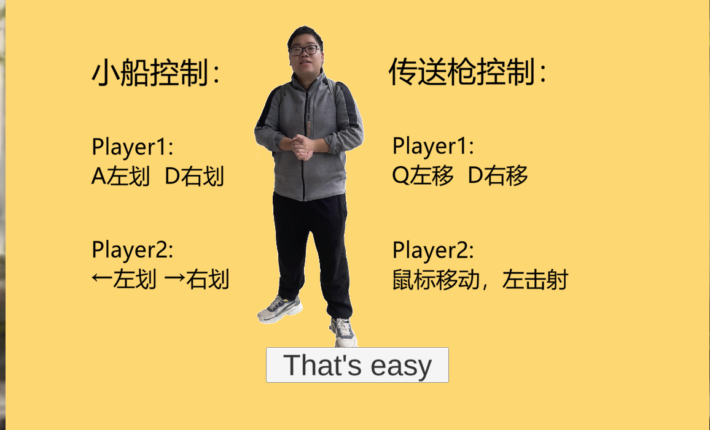

​	点击排行榜，可以查看当前个人排名及排行榜排名前十的队伍：

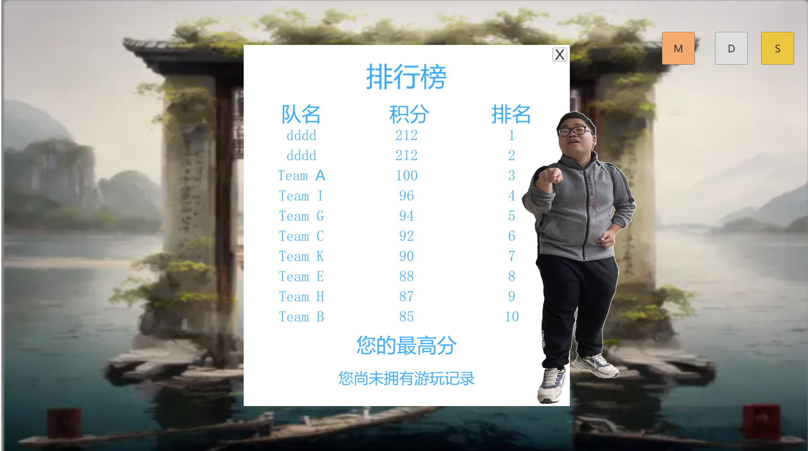

​	点击注册一个可用账号之后，可以使用账号登录游戏，如果账号密码不对，则会弹出提示：

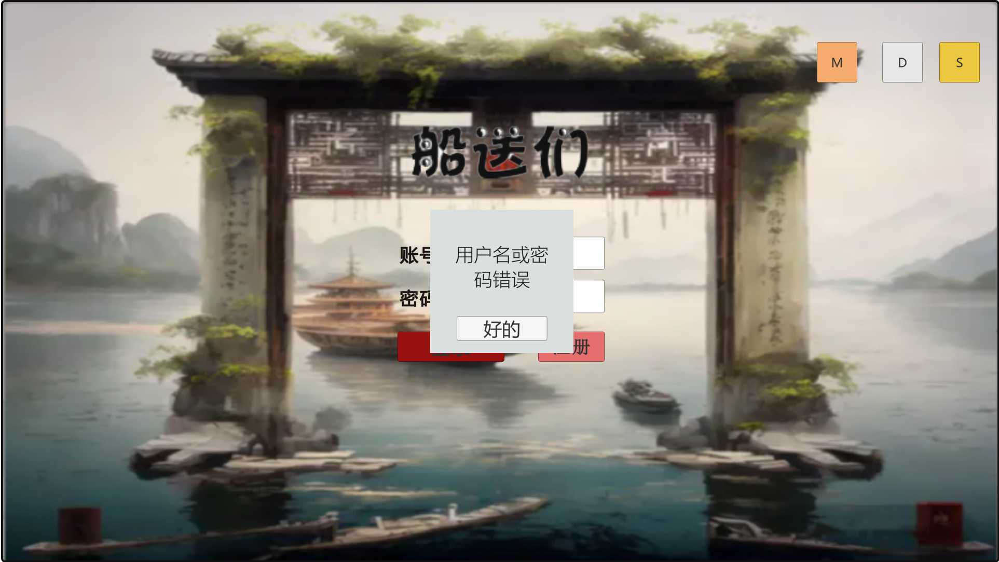

### 主体游玩界面：

​	进入游戏之后我们可以看到两位玩家的角色及游戏地图，小船会随着水流顺流而下，途中会遇到障碍物和血包。玩家共有十点血量，撞上障碍物会扣除一点血量并减十分，撞上血包会加上一点血量并加十分。

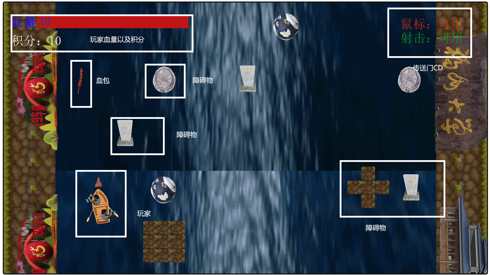

​	游戏的游玩过程中存在“救人系统”，会在障碍物两旁出现男生“丁假”以及女生“永雏唐菲”，如果救“丁假”会收到“丁假”的祝福，船会变小，但是会受到“永雏唐菲”的诅咒，水流的流速会加快。如果救“永雏唐菲”则会相反，船会变大但是水流流速会减慢。

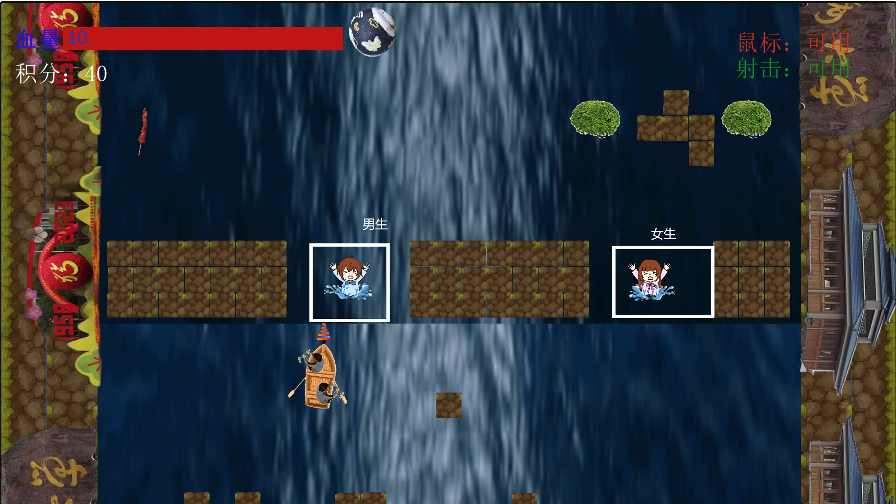

救助“丁假”效果：

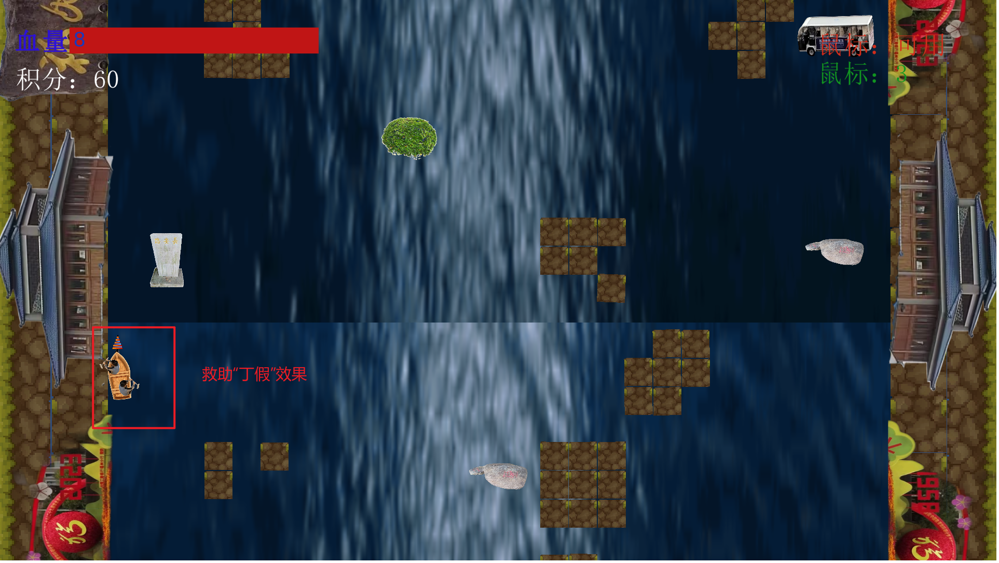

救助“永雏唐菲”效果：

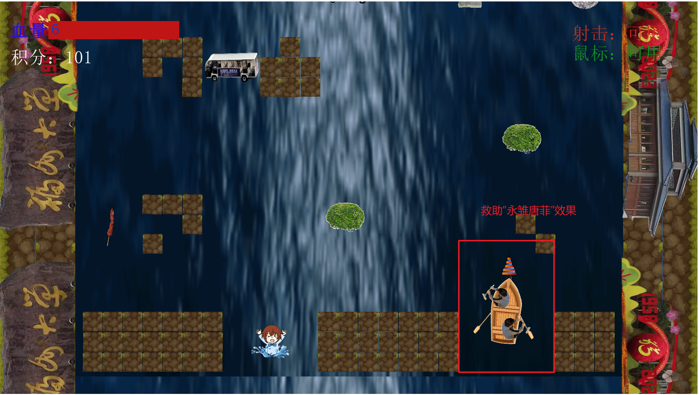

​	同时游戏的过程中会遇到大裂谷，玩家需要使用传送门的方式通过，不然等同于碰撞障碍物：

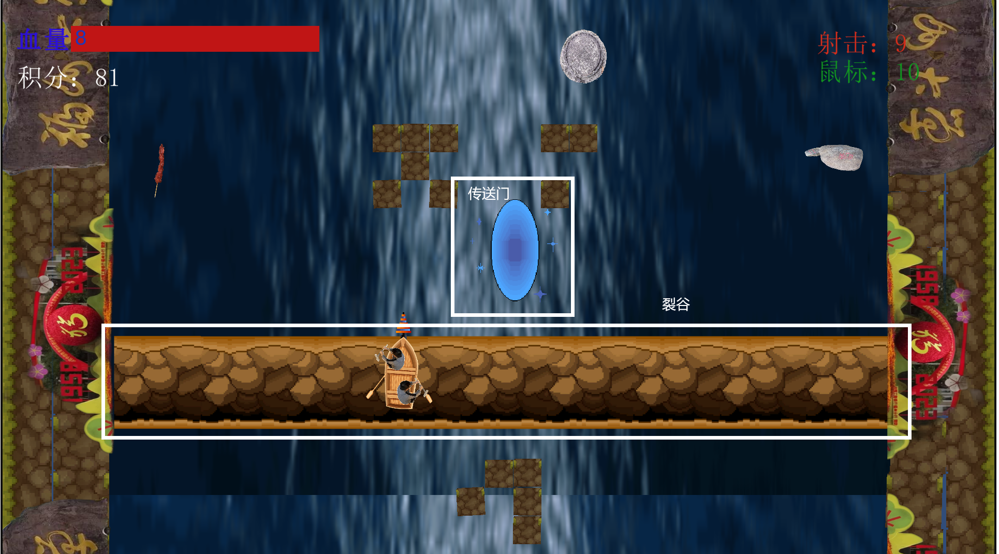

​	在游戏过程中玩家可以按下键盘“P”键暂停游戏进入暂停菜单：

​	游戏的暂停菜单会显示玩家的分数及相应的选项，玩家也可以查看排行榜。

​	在排行榜中，属于玩家的对于以及分数会被标红：

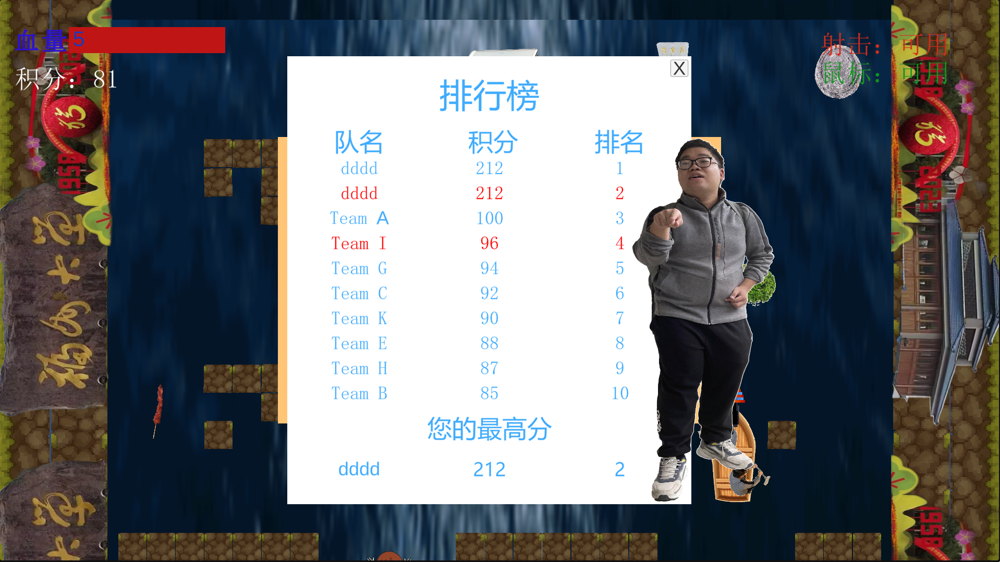

​	随着游戏时间的增加水流的流速会越来越快，当玩家血量归零时，游戏结束，弹出游戏结束菜单：

​	玩家可以进行“上传成绩”，“重新开始等操作”。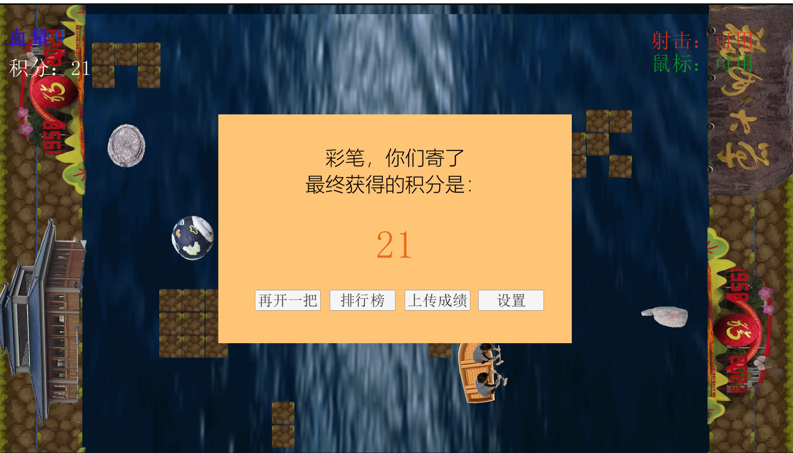

​	上传成绩时玩家可以输入合作玩家的ID或是选择“和陌生人合作”，之后系统会检测玩家的分数是否超过之前的记录，提示成绩是否有更新：

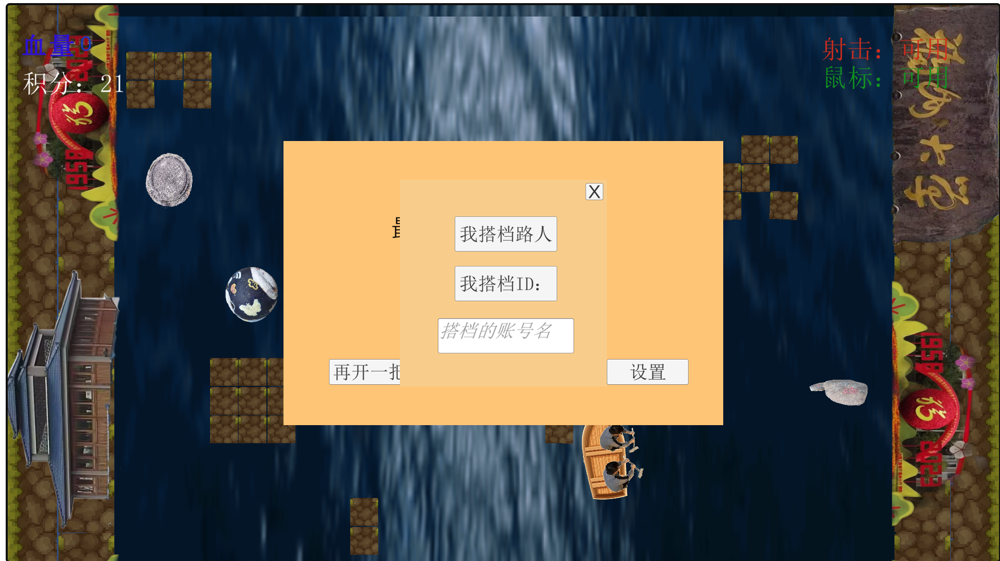

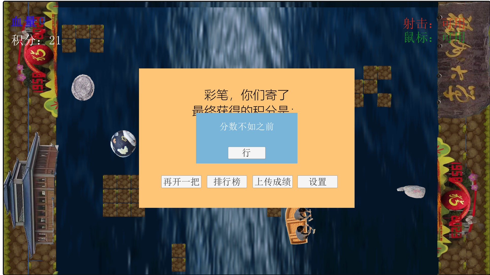